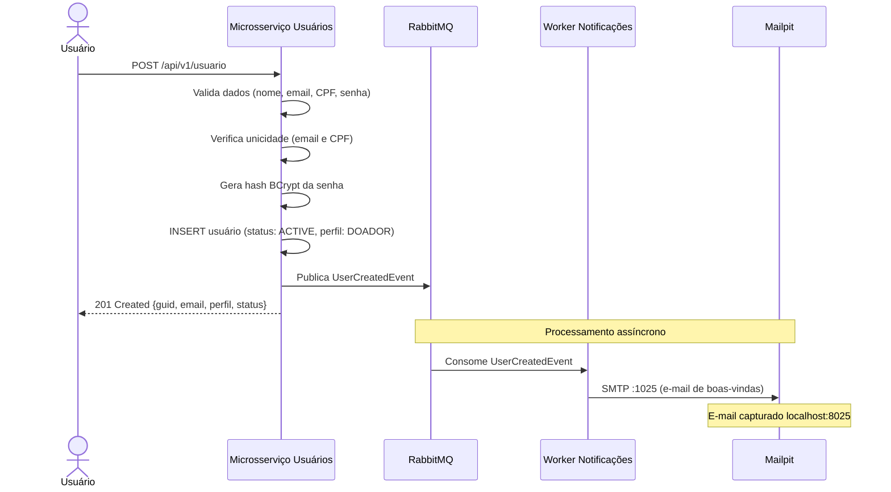
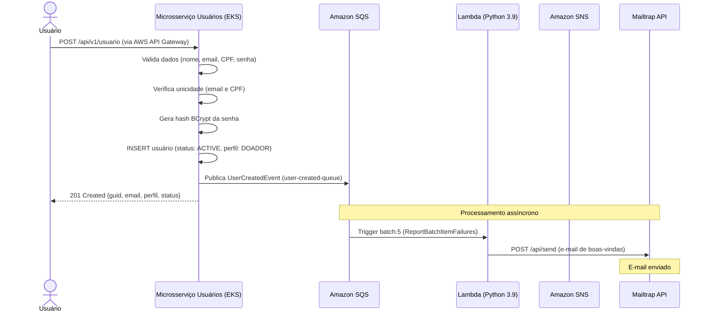
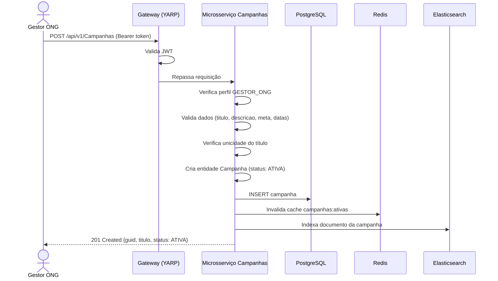
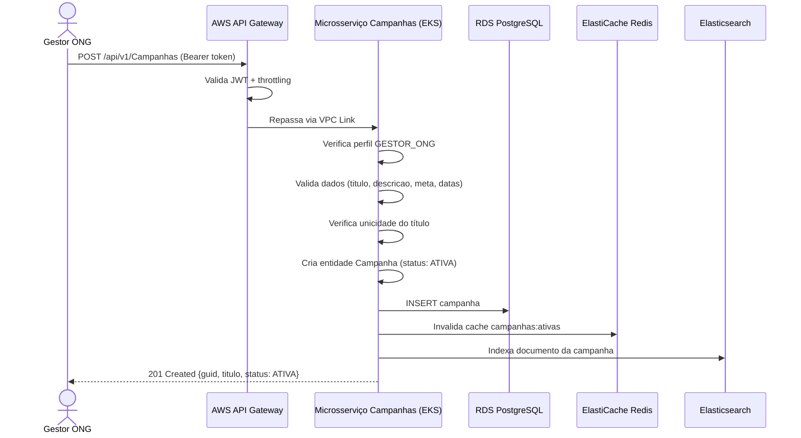
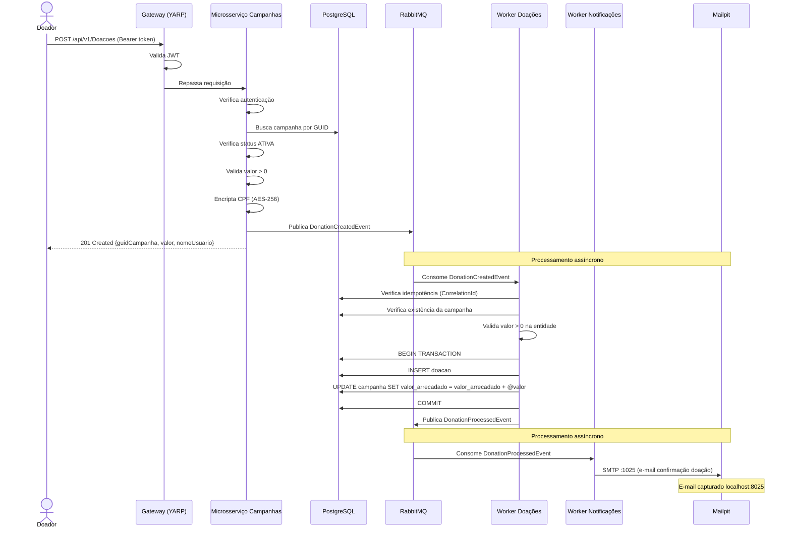
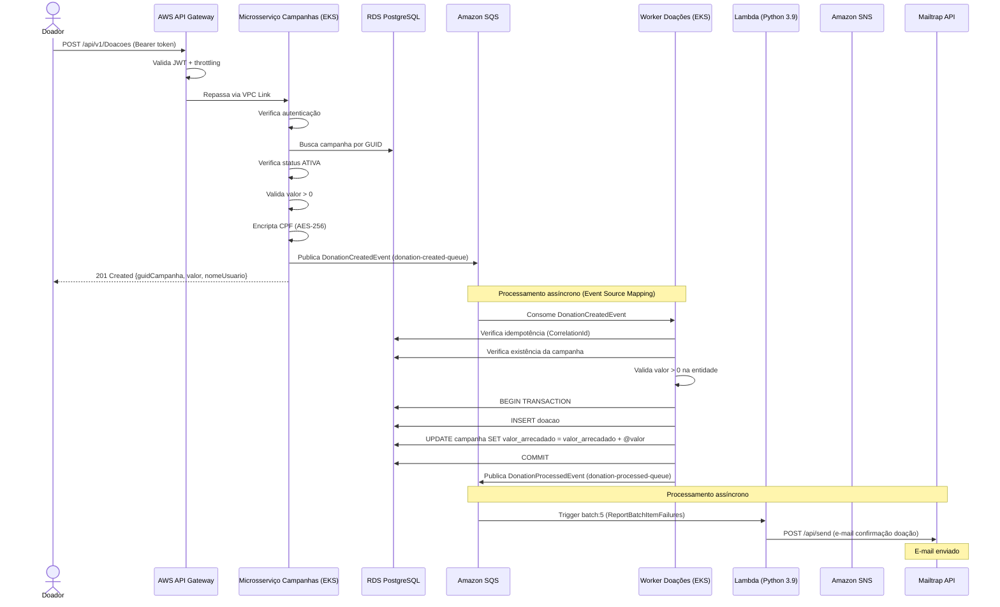

# Diagramas de Fluxo de Utilização para as APIs - Principais APIs
## Criação de usuário

### Local

### AWS

---

## Criação de campanha

### Local

### AWS

## Criação de Doação
### Local

### AWS

